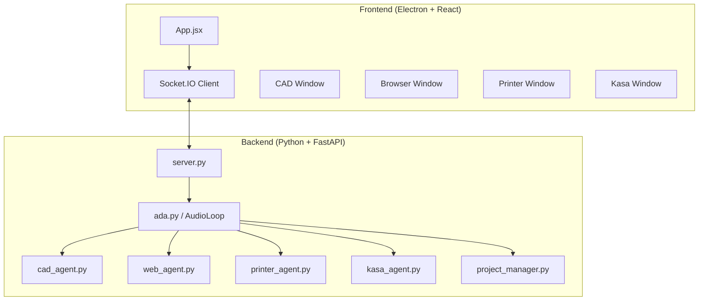

# LSO V2 - Logic Support Operator


LSO V2 is a desktop AI assistant for voice-first workflows with CAD generation, browser automation, smart-home control, and 3D printing.

The app runs as:
- `Electron + React` frontend
- `FastAPI + Socket.IO` Python backend
- `Gemini Live Audio` for real-time conversation and tool calling

---

## Project Overview

LSO is designed to be a practical engineering assistant:
- Real-time voice interaction
- CAD generation and iteration from natural language
- Browser task automation (Playwright)
- 3D printer discovery + slicing + job submission
- TP-Link Kasa device discovery and control
- Project-based memory and artifact organization

### Current Behavior (Important)
- Face authentication is disabled/removed from runtime flow.
- The app starts unlocked.
- Linux run is optimized via a single command (`dev:linux`).
- Audio loop has anti-feedback protection to reduce self-listening loops.

---

## Main Features

| Feature | Description | Stack |
|---|---|---|
| Voice Assistant | Low-latency full-duplex voice with tool calling | Gemini Live API |
| CAD Agent | Generates and iterates build123d scripts, exports STL | `build123d`, Gemini |
| Web Agent | Autonomous browser actions with screenshot/log stream | Playwright + Gemini Computer Use |
| 3D Printing | Discover printers, slice STL, submit jobs | OrcaSlicer, Moonraker/OctoPrint |
| Smart Home | Discover and control Kasa devices | `python-kasa` |
| Gesture UI | Hand tracking for window interaction | MediaPipe |
| Project Memory | Stores chat and artifacts per project | JSONL + files |

---

## Architecture



---

## Requirements

### System
- Linux (recommended workflow documented below)
- Python 3.11
- Node.js 18+
- npm

### Linux packages (audio + build tools)
```bash
sudo apt update
sudo apt install -y libportaudio2 portaudio19-dev build-essential python3-dev
```

### macOS packages
```bash
brew install portaudio
```

### Windows packages
- No extra package manager step is required for PortAudio in most setups.
- If PyAudio build/install fails, install Visual C++ Build Tools and retry.

### Python dependencies
Defined in `requirements.txt`.

### Frontend dependencies
Defined in `package.json`.

---

## Setup

### 1) Clone
```bash
git clone <your-repo-url>
cd ada_v2
```

### 2) Python venv
```bash
python3.11 -m venv .venv
source .venv/bin/activate
pip install -U pip
pip install -r requirements.txt
playwright install chromium
```

### 3) Node
```bash
npm install
```

### 4) Environment
Create `.env` in project root:
```env
GEMINI_API_KEY=your_key_here
```

---

## Run (Linux)

Recommended single-command flow:
```bash
npm run dev:linux
```

This starts, in parallel:
- backend (`backend/server.py`) using `.venv/bin/python` when available
- Vite dev server
- Electron app

You still get separate prefixed logs (`backend`, `vite`, `electron`) in one terminal.

### Alternative (2 terminals)
Terminal 1:
```bash
source .venv/bin/activate
python backend/server.py
```

Terminal 2:
```bash
npm run dev
```

## Run (macOS)

### Option A (single command)
```bash
npm run dev
```

### Option B (2 terminals)
Terminal 1:
```bash
source .venv/bin/activate
python backend/server.py
```

Terminal 2:
```bash
npm run dev
```

## Run (Windows)

### Option A (single command)
```powershell
npm run dev
```

### Option B (2 terminals)
Terminal 1 (PowerShell):
```powershell
.venv\Scripts\Activate.ps1
python backend/server.py
```

Terminal 2:
```powershell
npm run dev
```

---

## Settings

Runtime settings live in `settings.json`.

Common keys:
- `tool_permissions.*`: asks confirmation before sensitive tool actions
- `printers`: saved printer endpoints
- `kasa_devices`: cached discovered Kasa devices
- `camera_flipped`: gesture camera horizontal inversion

Note:
- `face_auth_enabled` is forced to `false` by current backend behavior.

---

## How LSO Works Internally

1. Frontend connects to `Socket.IO` backend.
2. User starts/auto-starts audio session.
3. Backend creates `AudioLoop`.
4. `AudioLoop` streams mic audio to Gemini Live and receives audio/transcription/tool calls.
5. Tool calls dispatch to specialized agents (CAD, Web, Printer, Kasa, Project Manager).
6. Results stream back to frontend windows in real time.

---

## Audio Notes (Mic/Echo)

The backend includes anti-feedback protection:
- loopback-like input devices are deprioritized
- half-duplex gate blocks mic while LSO is speaking + cooldown
- additional echo suppression for recent output bleed

If you still get self-listening loops:
- prefer a headset
- select the physical microphone in Settings
- avoid "monitor/loopback/stereo mix" devices

---

## CAD Workflow

- Generate: voice prompt or CAD window prompt
- Iterate: prompt modifications on current design
- Output: STL artifacts saved under project folders

Project data is organized in `projects/<project_name>/`.

---

## Printer Workflow

- Discover printers by mDNS/manual add
- Slice STL via OrcaSlicer profiles
- Send job to Moonraker/OctoPrint-like endpoints
- Monitor progress via periodic status updates

---

## Project Structure

```text
ada_v2/
├── backend/
│   ├── ada.py
│   ├── server.py
│   ├── cad_agent.py
│   ├── web_agent.py
│   ├── printer_agent.py
│   ├── kasa_agent.py
│   ├── project_manager.py
│   └── tools.py
├── electron/
│   └── main.js
├── src/
│   ├── App.jsx
│   ├── index.css
│   └── components/
├── projects/
├── printer_profiles/
├── settings.json
├── requirements.txt
├── package.json
└── README.md
```

---

## Troubleshooting

### `ImportError: libportaudio.so.2`
```bash
sudo apt install -y libportaudio2 portaudio19-dev
source .venv/bin/activate
pip install --force-reinstall --no-cache-dir pyaudio
```

### macOS PyAudio errors
```bash
brew install portaudio
source .venv/bin/activate
pip install --force-reinstall --no-cache-dir pyaudio
```

### Windows PyAudio errors
- Update `pip` first:
```powershell
python -m pip install -U pip setuptools wheel
```
- Reinstall PyAudio:
```powershell
pip install --force-reinstall --no-cache-dir pyaudio
```
- If it still fails, install Visual C++ Build Tools and retry.

### Backend starts but no mic capture
- Confirm selected device is a real mic
- Check backend logs for detected input devices
- Check Linux sound settings / permission prompts

### Electron opens but backend not responding
- Verify backend reachable at `http://127.0.0.1:8000/status`
- Ensure `.env` contains valid `GEMINI_API_KEY`

---

## License

MIT. See `LICENSE`.
